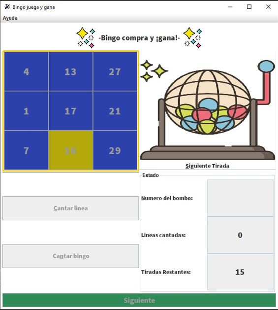

<h1 align="center">-Bingo comercial-</h1>

Descripcion

Aplicacion de Bingo que funciona con codigos promocionales que dan acceso a tiradas y segun el
resultado de la partida el usuario podra acceder a diversos premios, implementa un sistema de ayuda
y un diseño Responsive para adaptarse a multiples dispositivos.

Para ejecutar la aplicacion solo hay que iniciar la clase Main del paquete IGU, la aplicacion
esta pensada para consumir los tickets que el usuario ingrese, si se quieren añadir más códigos 
solo hay que añadirlos en el fichero tickets.dat del directorio files

-Especifiaciones técnicas-

Desarrollado en Java 16.0.2 y herramienta WindowBuilder

